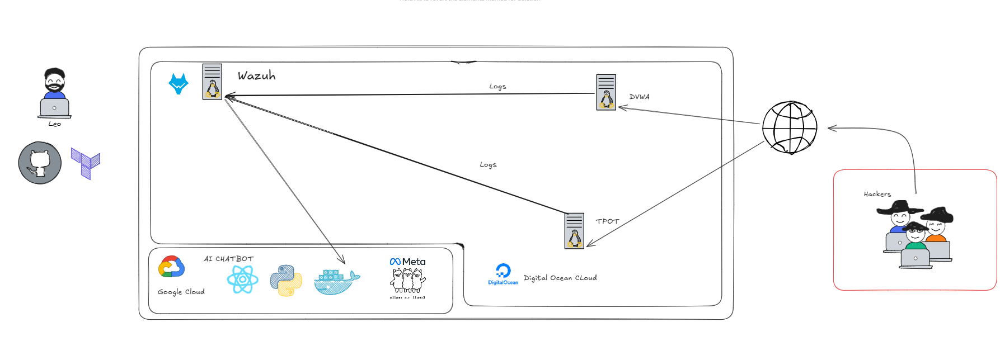

# IaNetworking - Sistema de Inteligencia Artificial para Ciberseguridad

## 📋 Descripción del Proyecto

IaNetworking es una plataforma integral de ciberseguridad que combina herramientas de monitoreo de seguridad (Wazuh), honeypots (TPOT), aplicaciones vulnerables para testing (DVWA) y un chatbot inteligente para análisis de logs de seguridad.

### 🏗️ Arquitectura del Sistema

```
┌─────────────────┐    ┌─────────────────┐    ┌─────────────────┐
│   Frontend      │    │   Backend       │    │ Infraestructura │
│   (Next.js)     │◄──►│   (FastAPI)     │◄──►│   (Terraform)   │
│                 │    │                 │    │                 │
│   - Chat UI     │    │   - WebSocket   │    │   - Wazuh Server│
│   - Auth        │    │   - Ollama LLM  │    │   - TPOT Server │
│                 │    │   - Log Analysis│    │   - DVWA Server │
└─────────────────┘    └─────────────────┘    └─────────────────┘
```

### Diagrama 



## 🚀 Despliegue Rápido

### Prerrequisitos

- **Terraform** >= 1.0
- **Docker** >= 20.10
- **Node.js** >= 18.0
- **Python** >= 3.9
- **DigitalOcean Account** con API Token
- **Gcloud** Despliegue de infraestructura para Gcp
- **SSH Keys** configuradas

### 1. Configuración Inicial

#### 🔑 Generación de SSH Keys

**IMPORTANTE:** Por seguridad, genera nuevas SSH keys para este proyecto:

```bash
# Generar par de claves SSH
ssh-keygen -t rsa -b 4096 -C "ia-networking@security" -f ~/.ssh/ia_networking_key

# Verificar la generación
ls -la ~/.ssh/ia_networking_key*
```

**Configuración de permisos:**
```bash
chmod 700 ~/.ssh
chmod 600 ~/.ssh/ia_networking_key
chmod 644 ~/.ssh/ia_networking_key.pub
```

#### 🔧 Configuración de Variables

Crear archivo `infraestructure/terraform/terraform.tfvars`:

```hcl
# DigitalOcean Configuration
do_token = "tu_digitalocean_api_token"

# SSH Keys (usar las rutas de las keys generadas)
sshKey = "~/.ssh/ia_networking_key.pub"
privateSshKey = "~/.ssh/ia_networking_key"

# VPC Configuration
vpc_uuid = "tu_vpc_uuid_en_digitalocean"

# Server Names (opcional)
vm_name_wazuh = "ia-wazuh-server"
vm_tpot_name = "ia-tpot-server"
vm_dvwa_name = "ia-dvwa-server"
```

### 2. Despliegue de Infraestructura

```bash
# Navegar al directorio de Terraform
cd infraestructure/terraform

# Inicializar Terraform
terraform init

# Verificar el plan
terraform plan

# Aplicar la configuración
terraform apply
```

**Servidores que se crearán:**
- **Wazuh Server**: Monitoreo de seguridad y SIEM
- **TPOT Server**: Honeypot para captura de amenazas
- **DVWA Server**: Aplicación vulnerable para testing

### 3. Despliegue de la Aplicación

#### Backend (FastAPI + Ollama)

```bash
# Navegar al directorio del backend
cd app/backend

# Instalar dependencias
pip install -r requirements.txt

# Configurar variables de entorno
export OLLAMA_BASE_URL="https://tu-ollama-server.com"
export OLLAMA_MODEL="llama3"
export API_KEY="tu_api_key_segura"
export REMOTE_HOST="ip_del_servidor_wazuh"
export SSH_USERNAME="root"
export SSH_PRIVATE_KEY="~/.ssh/ia_networking_key"

# Ejecutar en modo desarrollo
python main.py

# O usar el script de despliegue
cd app
./deploy.sh docker
```

#### Frontend (Next.js)

```bash
# Navegar al directorio del frontend
cd app/frontend

# Instalar dependencias
npm install

# Configurar variables de entorno
cp .env.example .env.local
# Editar .env.local con las URLs correctas

# Ejecutar en modo desarrollo
npm run dev

# Construir para producción
npm run build
npm start
```

## 🔒 Configuración de Ciberseguridad

### SSH Security Best Practices

#### 1. Configuración de SSH Server

```bash
# Editar configuración SSH
sudo nano /etc/ssh/sshd_config

# Configuraciones recomendadas:
Port 2222                    # Cambiar puerto por defecto
PermitRootLogin no           # Deshabilitar login root
PasswordAuthentication no     # Solo autenticación por clave
PubkeyAuthentication yes     # Habilitar autenticación por clave
MaxAuthTries 3              # Limitar intentos de autenticación
ClientAliveInterval 300      # Timeout de conexión
ClientAliveCountMax 2
AllowUsers tu_usuario        # Solo usuarios específicos
```

#### 2. Firewall Configuration

```bash
# Configurar UFW
sudo ufw default deny incoming
sudo ufw default allow outgoing
sudo ufw allow 2222/tcp      # SSH
sudo ufw allow 80/tcp        # HTTP
sudo ufw allow 443/tcp       # HTTPS
sudo ufw allow 8000/tcp      # API Backend
sudo ufw allow 3000/tcp      # Frontend Dev
sudo ufw enable
```

#### 3. Fail2ban Configuration

```bash
# Instalar Fail2ban
sudo apt install fail2ban

# Configurar
sudo cp /etc/fail2ban/jail.conf /etc/fail2ban/jail.local
sudo nano /etc/fail2ban/jail.local

# Configuraciones recomendadas:
[DEFAULT]
bantime = 3600
findtime = 600
maxretry = 3

[sshd]
enabled = true
port = 2222
logpath = /var/log/auth.log
```

### 🔐 Gestión de Claves SSH

#### Generación Segura de Claves

```bash
# Generar clave RSA de 4096 bits
ssh-keygen -t rsa -b 4096 -C "ia-networking@security" -f ~/.ssh/ia_networking_key

# Generar clave Ed25519 (más segura y rápida)
ssh-keygen -t ed25519 -C "ia-networking@security" -f ~/.ssh/ia_networking_key_ed25519

# Generar clave con passphrase
ssh-keygen -t rsa -b 4096 -C "ia-networking@security" -f ~/.ssh/ia_networking_key -N "tu_passphrase_segura"
```

#### Configuración de SSH Client

Crear/editar `~/.ssh/config`:

```bash
# Configuración para IaNetworking
Host ia-wazuh
    HostName IP_DEL_SERVIDOR_WAZUH
    User root
    Port 2222
    IdentityFile ~/.ssh/ia_networking_key
    IdentitiesOnly yes
    ServerAliveInterval 60
    ServerAliveCountMax 3

Host ia-tpot
    HostName IP_DEL_SERVIDOR_TPOT
    User root
    Port 2222
    IdentityFile ~/.ssh/ia_networking_key
    IdentitiesOnly yes

Host ia-dvwa
    HostName IP_DEL_SERVIDOR_DVWA
    User root
    Port 2222
    IdentityFile ~/.ssh/ia_networking_key
    IdentitiesOnly yes
```

#### Rotación de Claves SSH

```bash
# Script para rotación de claves
#!/bin/bash
# rotate_ssh_keys.sh

OLD_KEY="~/.ssh/ia_networking_key"
NEW_KEY="~/.ssh/ia_networking_key_new"

# Generar nueva clave
ssh-keygen -t ed25519 -C "ia-networking@security" -f $NEW_KEY

# Copiar nueva clave a servidores
ssh-copy-id -i $NEW_KEY.pub root@IP_WAZUH -p 2222
ssh-copy-id -i $NEW_KEY.pub root@IP_TPOT -p 2222
ssh-copy-id -i $NEW_KEY.pub root@IP_DVWA -p 2222

# Verificar conexión con nueva clave
ssh -i $NEW_KEY root@IP_WAZUH -p 2222 "echo 'Nueva clave funciona'"

# Si todo está bien, reemplazar clave antigua
mv $NEW_KEY $OLD_KEY
mv $NEW_KEY.pub $OLD_KEY.pub
```

### 🛡️ Hardening de Servidores

#### 1. Actualización Automática

```bash
# Configurar actualizaciones automáticas
sudo apt install unattended-upgrades
sudo dpkg-reconfigure -plow unattended-upgrades

# Configurar para reiniciar automáticamente si es necesario
echo 'Unattended-Upgrade::Automatic-Reboot "true";' | sudo tee -a /etc/apt/apt.conf.d/50unattended-upgrades
```

#### 2. Monitoreo de Logs

```bash
# Instalar herramientas de monitoreo
sudo apt install logwatch fail2ban rkhunter

# Configurar logwatch
sudo nano /etc/logwatch/conf/logwatch.conf

# Configurar alertas por email
sudo apt install postfix
sudo nano /etc/postfix/main.cf
```

#### 3. Auditoría de Seguridad

```bash
# Instalar herramientas de auditoría
sudo apt install auditd audispd-plugins

# Configurar auditoría
sudo nano /etc/audit/auditd.conf
sudo nano /etc/audit/rules.d/audit.rules

# Reglas básicas de auditoría
-w /etc/passwd -p wa -k identity
-w /etc/group -p wa -k identity
-w /etc/shadow -p wa -k identity
-w /etc/sudoers -p wa -k scope
-w /var/log/auth.log -p wa -k authentication
```

## 📊 Monitoreo y Mantenimiento

### Health Checks

```bash
# Verificar estado de servicios
curl http://IP_SERVIDOR:8000/health

# Verificar logs de Wazuh
ssh ia-wazuh "tail -f /var/ossec/logs/ossec.log"

# Verificar estado de TPOT
ssh ia-tpot "docker ps"

# Verificar estado de DVWA
ssh ia-dvwa "systemctl status apache2"
```

### Backup y Recuperación

```bash
# Script de backup
#!/bin/bash
# backup_ia_networking.sh

BACKUP_DIR="/backup/ia_networking"
DATE=$(date +%Y%m%d_%H%M%S)

# Crear directorio de backup
mkdir -p $BACKUP_DIR/$DATE

# Backup de configuración Wazuh
ssh ia-wazuh "tar -czf /tmp/wazuh_config.tar.gz /var/ossec/etc"
scp ia-wazuh:/tmp/wazuh_config.tar.gz $BACKUP_DIR/$DATE/

# Backup de logs
ssh ia-wazuh "tar -czf /tmp/wazuh_logs.tar.gz /var/ossec/logs"
scp ia-wazuh:/tmp/wazuh_logs.tar.gz $BACKUP_DIR/$DATE/

# Backup de configuración de la aplicación
tar -czf $BACKUP_DIR/$DATE/app_config.tar.gz app/backend/
```

## 🚨 Incident Response

### Procedimientos de Emergencia

#### 1. Compromiso Detectado

```bash
# Aislar servidor comprometido
ssh ia-wazuh "iptables -A INPUT -j DROP"

# Crear snapshot de DigitalOcean
doctl compute droplet-action snapshot DROPLET_ID --snapshot-name "incident_$(date +%Y%m%d_%H%M%S)"

# Preservar evidencia
ssh ia-wazuh "dd if=/dev/sda of=/tmp/evidence.img bs=1M"
```

#### 2. Recuperación

```bash
# Restaurar desde snapshot
doctl compute droplet-action restore DROPLET_ID --image-id SNAPSHOT_ID

# Verificar integridad
ssh ia-wazuh "rkhunter --check --skip-keypress"
ssh ia-wazuh "clamscan -r /"
```

## 📚 Documentación Adicional

### Comandos Útiles

```bash
# Ver logs en tiempo real
tail -f /var/log/syslog

# Verificar puertos abiertos
netstat -tulpn

# Verificar procesos
ps aux | grep suspicious

# Verificar conexiones activas
ss -tulpn

# Verificar espacio en disco
df -h

# Verificar memoria
free -h
```

### Troubleshooting

#### Problemas Comunes

1. **Error de conexión SSH**
   ```bash
   # Verificar permisos de clave
   ls -la ~/.ssh/ia_networking_key
   
   # Verificar configuración SSH
   ssh -v ia-wazuh
   ```

2. **Servicio no responde**
   ```bash
   # Verificar logs del servicio
   sudo journalctl -u nombre_servicio -f
   
   # Reiniciar servicio
   sudo systemctl restart nombre_servicio
   ```

3. **Problemas de red**
   ```bash
   # Verificar conectividad
   ping IP_SERVIDOR
   
   # Verificar DNS
   nslookup dominio.com
   
   # Verificar firewall
   sudo ufw status
   ```

## 🤝 Contribución

1. Fork el proyecto
2. Crear una rama para tu feature (`git checkout -b feature/AmazingFeature`)
3. Commit tus cambios (`git commit -m 'Add some AmazingFeature'`)
4. Push a la rama (`git push origin feature/AmazingFeature`)
5. Abrir un Pull Request

## 📄 Licencia

Este proyecto está bajo la Licencia MIT. Ver el archivo `LICENSE` para más detalles.

## 📞 Soporte

Para soporte técnico o preguntas sobre seguridad:
- Email: security@ia-networking.com
- Issues: [GitHub Issues](https://github.com/tu-usuario/ia-networking/issues)

---

**⚠️ ADVERTENCIA DE SEGURIDAD:** Este proyecto incluye herramientas de ciberseguridad y honeypots. Úsalo solo en entornos controlados y autorizados. El uso indebido puede ser ilegal. 